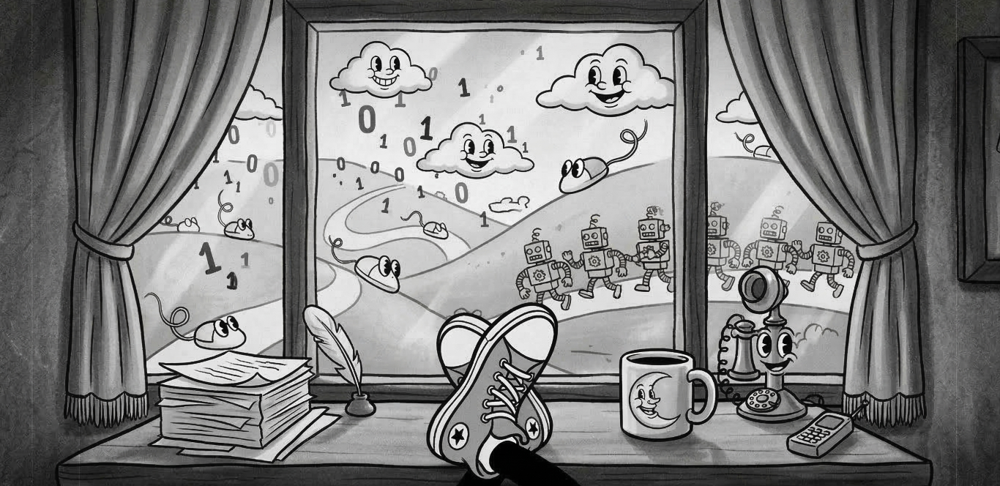

Hello World! I’m Marian. Welcome to my window office, I mean by blog. 🫣

After reading, a few weeks ago, Anthropic's article on [writing a C compiler from scratch with Claude](https://www.anthropic.com/engineering/building-c-compiler), I went down a rabbit hole of binge reading many articles and research papers about AI, agents, orchestrations, and model optimizations. I loved it, and a biproduct of this adventure in Wonderland is a renewed interest in writing more. About what? Stay tuned, this is a developing story...

The C compiler article captured so well the LLM's raw and relentless pursuit of a target goal in a methodical way, with learning, execution, and delivery of the goal all blending in a blur. While intriguing, it feels like something was taken away from us – a loss reminiscent of the corner bookstore feel gone in favor of a more practical web store with a virtual cart. Behind every line of battle-tested code we wrote hides an emotional state that we carry with us, outside source control, and it’s becoming clearer that the tech industry is ready to move beyond it. 

At the same time, I carry three LLMs in my pocket every day and another one is blinking an indifferent CLI cursor on my desktop as I write this. The possibilities seem to grow by the day, and the taste of real outcomes seem imminent. In contrast, in that bookstore, while browsing books in the pursuit of knowledge, the thought of ever writing a full C compiler by myself felt very distant, both a dream and a nightmare at the same time. 

## _Is it contradictory to feel both loss and wonder for the progress AI is making? Sure, but this doesn't diminish either. In fact, experiencing both can ground us when engaging with, and trying to master the new AI tools at our disposal, and motivate us to keep exploring what comes next_

Welcome to my window office, from where I'll try to do exactly that, and share, from time to time, some of my writing. The topics will veer off the beaten path of my day-to-day job, so it feels appropriate to share them here with the disclaimer that they don’t represent the views of my employer. I have a plan for the next few posts, so stay tuned for more. Thanks for reading thus far, and "like and subscribe".

PS: At Microsoft, the window office was a sought-after possession in a different era, implying a position of seniority and, more dangerously, a misguided perception of authority. I used to joke about aspiring to make window office decisions. This is my tongue-in-cheek way of continuing the joke here knowing that I hold no direct authority on any of the topics I'll be discussing, I am just sharing my views from wherever I sit, knowing things will keep evolving.
