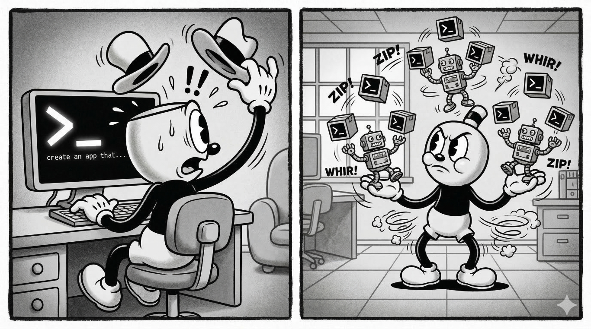

## _How agents will change again and how we may prepare for it_
During my years at Microsoft, I worked on bringing various C++ compilers in one form or another into customers' hands. News of Anthropic [writing a C compiler from scratch with AI](https://www.anthropic.com/engineering/building-c-compiler) caught my attention for all the reasons you might expect. However, what stood out to me was not related to the C compiler itself, but has all to do with what's coming next in the season of agents. 

## Nobody’s building for chat anymore

The AI flywheel has an impressive yet bizarre property to compress time through innovation, packing what typically feels like decades of progress into years and months. We need to [talk about seasons not timelines](https://lennysvault.com/insights/leadership-perspectives/dd9b7967-1493-456f-a868-020fadfe7866) because relying on quarterly rhythms, OKRs, or semester milestones in traditional enteprise planning modes is dauntingly rigid. Engulfed in all the fray of rapid-fire news, it feels almost serendipitous to notice the unmistakable signs that a new season is well underway: *Nobody’s building for chat anymore*. 

Remember your favorite LLMs from approximately a year ago, [answering your questions](https://openai.com/index/introducing-gpt-5/) in multimodal chat conversations? Model makers are already designing now for long-running agent workflows and optimizing for sophisticated use cases. Just as a thick layer of yellow-red leaves paint the unmistakable autumn, or the bite of crisp air, snowfall, and the scent of firewood mark winter, we are all witnessing right now the breakthroughs of <mark>the current season of agents</mark>: 
* context windows [_almost_ have a grasp on large codebases](https://www.anthropic.com/engineering/effective-context-engineering-for-ai-agents), 
* we connect an increasing number of tools to our workflows to get real work done, 
* [agentic "plan -> act -> observe -> repeat" loops](https://code.visualstudio.com/updates/v1_105#_plan-agent) run for longer and with less human intervention, 
* with [greater access via RAG](https://www.microsoft.com/en-us/research/blog/graphrag-improving-global-search-via-dynamic-community-selection/) to vast repositories of data,
* we set LLMs free (or loose, depending on your perspective) with “persistent” [Ralph loops](https://ghuntley.com/loop/) and [OpenClaw](https://www.techrepublic.com/article/news-openclaw-shadow-ai-agents-enterprise-security-risks/), and 
* we experiment with agent swarms such as [Gastown](https://github.com/steveyegge/gastown) or [Squad](https://github.com/bradygaster/squad), each with distinct personas, to operate in complex orchestrations

## What happens next

Something big [_is_ indeed happening](https://shumer.dev/something-big-is-happening) and, as the software industry is contending with these changes, much is being written about its future. Many current discussions about AI (visionary or cautionary alike) center on the potential impact of some abstract future advances in agent orchestration. What’s less explored is what will happen next. 

## _What happens next is what I want to focus on in this series, as it may not be immediately evident and it's certainly not inevitable. Getting there will take hard work, experimentation, learning from failures, and a bit of luck from teams competing in this field._

Just like the early signs of a season change, a first leaf turning yellow or a first snowflake dancing down, there are already signs in the industry of future breakthroughs that could fuel the next leap in agentic efficiency. These changes can stack upon one another and usher us in <mark>the next season of agents</mark>. 

If everything goes well, we, as users, will shift our focus to agent outcomes rather than their underlying mechanics (but let's put a pin on that 📌 and revisit the topic when we wrap up the series). First, let’s discuss how agents may evolve. In part 2 of this series, I'll cover agent parallelization.
