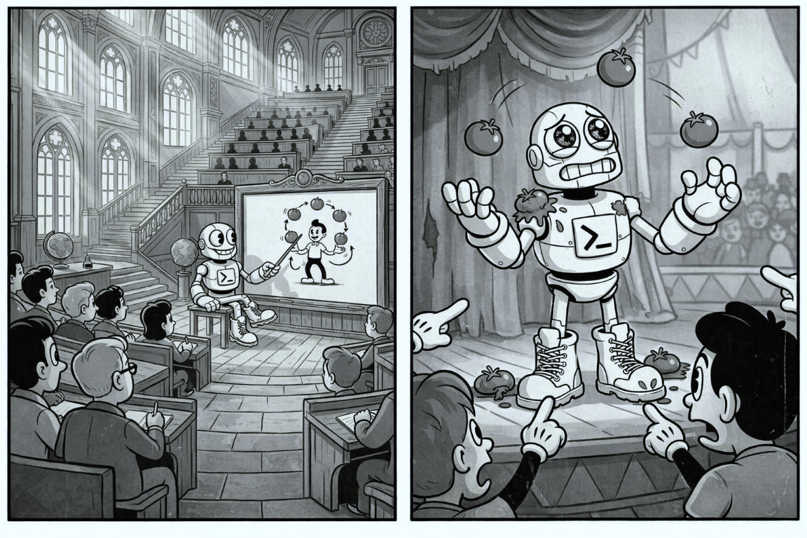
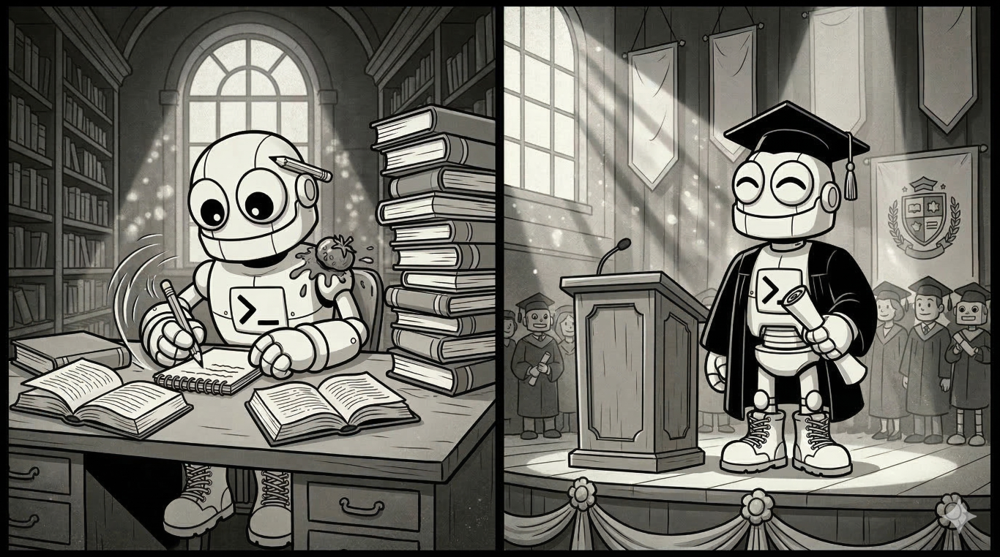

## _How agents will change again and how we may prepare for it_

So much can change in one year, and even more in just six months. The season of agents is now in full swing, and no one is building for chat anymore. In this post, we'll discuss **parallelization**: what current capabilities exist and what may come next. None of the predictions mentioned here are inevitable, and each will require significant effort to materialize, some may never pan out. However, if they all stack together, it can spell the beginning of a whole new season of agents.

When it comes to parallelization, models today can answer the most complex questions, generate code for modern multicore systems and overall, clearly demostrate that they have absorbed much of the literature on the subject. So, <mark>why are models still ineffective at parallelizing their own work?</mark>

## 🪧The early signs
We can observe the early signs of agent parallelization in two approaches that can offer us some insights into the future:

1. **Subagents**: Last month, Visual Studio Code introduced the ability to parallelize agent invocations: [Subagents in Visual Studio Code](https://code.visualstudio.com/docs/copilot/agents/subagents). Granularity is at the agent level, and you can define your own custom agents or use the default inbox agents provided:

> _When you request parallel analysis (for example, "analyze security, performance, and accessibility simultaneously"), VS Code runs those subagents concurrently and waits for all results before the main agent continues_ — <cite>excerpt from [Subagents in Visual Studio Code](https://code.visualstudio.com/docs/copilot/agents/subagents)</cite>

Similar capabilities have been available in Claude Code as well. Notably, subagents do not inherit any context from the parent agent, starting with a clean slate, reminiscent of [Windows' `CreateProcess()`](https://learn.microsoft.com/en-us/windows/win32/api/processthreadsapi/nf-processthreadsapi-createprocessw) and can only return results after the subagent has finished (requiring the parent agent to sit and wait for completion). 

2. **Parallel agents**: The most intriguing aspect of [the C compiler building experiment](https://www.modular.com/blog/the-claude-c-compiler-what-it-reveals-about-the-future-of-software) I mentioned in part 1 is that the author managed to set 16 Claude instances to run _successfully_ in parallel, using simple synchronization mechanisms:

> _My implementation of parallel Claude is bare-bones. […] To prevent two agents from trying to solve the same problem at the same time, the harness uses a simple synchronization algorithm_ — <cite>excerpt from [Building a C compiler with a team of parallel Claudes by Nicholas Carlini](https://www.anthropic.com/engineering/building-c-compiler)</cite>

All instances begin with the same initial environment, reminiscent of [Linux `fork()` process duplication](https://www.man7.org/linux/man-pages/man2/fork.2.html). Task selection is the only contention point the author specifically addressed to enable concurrency. Things can get a bit hectic in this “Stage 8” of parallel agent orchestration (as [Steve Yegge's “Welcome to Gastown”](https://steve-yegge.medium.com/welcome-to-gas-town-4f25ee16dd04) coined it):

> _Some bugs get fixed 2 or 3 times, and someone has to pick the winner. Other fixes get lost. Designs go missing and need to be redone. It doesn't matter, because you are churning forward relentlessly on huge, huge piles of work_ — <cite>excerpt from [Welcome to Gastown by Steve Yegge](https://steve-yegge.medium.com/welcome-to-gas-town-4f25ee16dd04)</cite>

Don't let any of these limitations or my comparison to basic multithreaded primitives like `CreateProcess()` or `fork()` distract you from how powerful these agentic capabilities already are. You can accomplish a great deal already, but - and here's the big rub - these approaches are riddled with inefficiencies, especially when token cost and time-to-success are major concerns.

## 🔮The next breakthrough

## _So why are models ineffective at parallelizing agentic work? Because agents lack the higher-level primitives needed for parallelization: task scheduling, synchronization, and data sharing mechanisms._

**Prediction**: Models will acquire the ability, methodologies, and data structures necessary to parallelize by themselves the work we're assigning them to perform. Achieving a significant breakthrough in agent parallelization will require the native integration of new parallelization tools into agents (and later into model training). Without these tools, the effort required for a model to implement more granular parallelization diverts too much attention from the primary objective, leading to negative results. 

Let's imagine how these <mark>new tools</mark> can initially help agents delegate more efficiently in order to complete tasks faster, and eventually, enable models to handle complex jobs involving dynamic branching and coordination:

1. **Task creation**: Similar to subagent creation, a `create_task` tool can enable the parent agent to delegate execution of a specific task to another worker agent. When invoking a `create_task` operation, the parent agent would provide (1) a definition of the _additional_ context needed to execute the task, (2) the dependencies that must be satisfied before starting the task (e.g., which other tasks must be completed first), and optionally (3) a priority. 

In contrast to subagents, subtasks will be suitable for very granular units of work and, importantly, they _will run on a copy of the parent agent's context_. This approach avoids the bootstrap problem that subagents currently face: when executing a small unit of work, they invariably end up 'rehydrating' much of the same context as their parent agent, invalidating the benefits of concurrent task execution. 

Sharing the context also lifts the burden of tracking transient tasks through `.md` task checklists or other heavy-weight workarounds like relying on long-term memory tools, which ultimately scar repo history or worse, pollute future context windows. However, repeatedly copying context across tasks can also introduce new context bloat issues. Let's revisit this challenge in part 3, where we'll talk exclusively about context. 

2. **Task scheduling**: Distribution & delegation of tasks will occur _without the main agent's involvement_, allowing the agent to focus on its primary directives. Assigning tasks to worker subagents will be based on priority, worker availability, and dependency status, using information collected from the main agent via `create_task`.

import CustomImage from '../../components/CustomImage.astro';
import DiagramP1 from '../../assets/images/next-season-of-agents-part-2-diagram-p1.png';

<CustomImage zoomable src={DiagramP1} alt="diagram of simple orchestration of 2 tasks from the main agent" 
description="Fig 1. Task creation and scheduling example. Both tasks _clone the parent agent's context_ for fast execution"/>

3. **Resource management**: resource consumption for each worker will be actively monitored, and availability will be determined dynamically based on (1) the local environment's load, (2) token consumption, and optionally by (3) user-defined rules specified in dedicated `.md` files for resource management.

4. **Synchronization and communication/data sharing**: unlike today's subagent parallelization, where the output data is confined to the subagent's lifetime, data will need to be decoupled from execution and will become mutable, allowing multiple execution branches to collaborate on the same variable data. New data structures will emerge that agents will depend on for:
    * message passing (e.g. `message_queue`, `future`/`promises`), 
    * data transfer (e.g., `shared_memory`), 
    * thread-safe collections (e.g., `shared_list`, `shared_map`),
    * and maybe even lower level data access locking to avoid races (e.g., `lock`, `atomic`, `barrier`), 

import DiagramP2 from '../../assets/images/next-season-of-agents-part-2-diagram-p2.png';

<CustomImage zoomable src={DiagramP2} alt="diagram of simple orchestration of 2 tasks from the main agent with synchronization and communication" description="Fig 2. Task orchestration with synchronization and communication between tasks. Example of mutable vars tool that _creates and shares data between tasks_."/>

5. **Monitoring & instrumentation**: the unsung hero of parallel execution, _instrumentation_, will allow users to observe the task orchestration, identify where time is being spent, and pinpoint challenges that don't exist in today's mostly single-threaded agents: racing conditions/deadlocks, starvation, cache contention, excessive branching, etc. 

Similar to resource management, automated oversight/diagnostics can be performed by specialized agents, which are designed to optimize tasks by analyzing traces of parallel runs according to rules predefined by users.

6. **Error handling/fault propagation**: All this won't be too smooth at first - these task orchestrations may occasionally collapse or even deadlock. With “good-enough” detection and error handling, agents will recover and resume their work, perhaps wasting some tokens in the process. However, that's acceptable because, over time, they will get better.

import DiagramP3 from '../../assets/images/next-season-of-agents-part-2-diagram-tasksched-mutablevars-v2.png';

<CustomImage zoomable src={DiagramP3} alt="interaction diagram between main agent loop, task scheduler tool, mutable variables tool, and the worker agent pool" description="Fig 3. Outline of interactions between the main agent loop, task scheduler, mutable variables tools, and the worker agent pool."/>

## _As models become more adept at using these new parallelization tools, focus will shift to scientific approaches rather than colloquial experimentation, and the top frontier models will eventually graduate from “[that 3-credit CS course](https://gfxcourses.stanford.edu/cs149/fall25)”. 🎓 You got this, LLMs!_

All these concepts are quite familiar to developers. If agent harnesses start to feel like deja-vu, it's because complex workflow automation inevitably becomes indistinguishable from programming. 

In summary, today we design parallel agentic workflows by invoking tools similar to `CreateProcess()`. In the future, frontier models may raise the abstraction level for parallel agent orchestration, allowing us to use richer constructs to achieve better parallelism. Possibly even sooner than [C++'s C++26-bound `std::execution()`](https://www.open-std.org/jtc1/sc22/wg21/docs/papers/2024/p2300r10.html) 🙂

However, any breakthrough in parallel agent orchestration, task scheduling/granular parallelization ultimately depends on an equivalent uptick in context engineering as well. So, let's talk about context in part 3.
