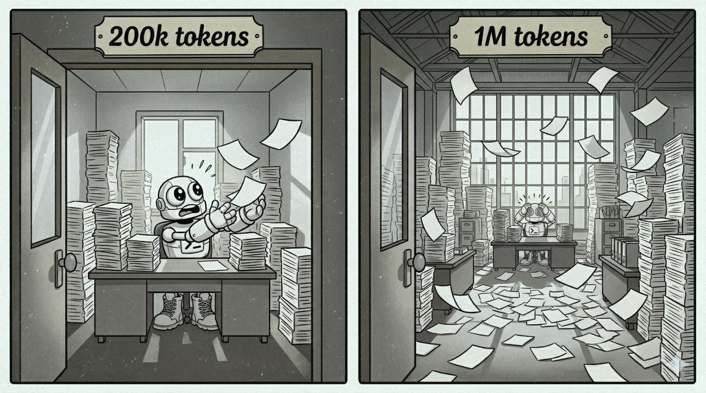

## _How agents will change again and how we may prepare for it_

In [part 1](../next-season-of-agents-part-1-chat-no-more) we discussed how no one is building for chat anymore. In [part 2](../next-season-of-agents-part-2-parallelization), we examined the early developments in subagent parallelization and made predictions about future advancements in that area. Let's focus on context in part 3.

A breakthrough in parallelization depends on efficiently orchestrating long-running loops and short-running tasks, using the new tools discussed in part 2. What is the main challenge as we push these limits? The biggest issue with long-running loops today is **context collapse**, which invariably occurs when something goes off track in the agentic workflow. Even when everything works as intended, LLMs still struggle during long loops with a decline in the LLM's attention and intent detection <mark>often attributed to **context rot**</mark>. Context rot is the unavoidable buildup of information generated by user inputs, LLM outputs, tool outputs, and the environment during execution.

The assumption that increasing context windows (e.g., to 1M tokens) allows LLMs to directly reason over entire codebases has been challenged by recent research. Failure modes include hallucinated edits, referencing files that do not exist, and producing malformed patch headers. This highlights a substantial gap between nominal context length and usable context capacity. 

## _We can't simply rely on ever-larger context windows. Let's admit that context pollution isn't sustainable, no matter the window size. To increase agent autonomy, we should rethink the fundamentals of how model context is (1) accumulated, (2) compacted, (3) filtered, and (4) shared._

## 🪧The early signs
Here are some signs that context improvements are necessary: 

1. **Memory to the rescue**: There is a growing reliance on memory as a solution for long-running agents. How does memory help? It allows them to flush irrelevant data from their context and start fresh. [Agentic memory for GitHub Copilot is now on by default](https://github.blog/changelog/2026-03-04-copilot-memory-now-on-by-default-for-pro-and-pro-users-in-public-preview/) and, my favorite hack, [Beads](https://steve-yegge.medium.com/introducing-beads-a-coding-agent-memory-system-637d7d92514a), is used as a "fail-fast & resume" method to prevent context collapse. 

> Point your AGENTS.md or CLAUDE.md at it with one line, and your agents will suddenly become good at long-horizon planning and work discovery. It's an instant cognitive upgrade. - <cite>excerpt from [Beads](https://steve-yegge.medium.com/introducing-beads-a-coding-agent-memory-system-637d7d92514a)</cite>

2. **Recursive Language Models**: RLMs are LLMs with a REPL environment, enabling them to explore long contexts as needed for task completion. [They seem most suitable for repetitive tasks](https://www.dbreunig.com/2026/02/09/the-potential-of-rlms.html) over unbounded inputs as they address context rot by managing and partitioning input data and then recursively calling themselves or other LLMs within the REPL environment to search, filter, and transform information. 

> By giving the LLM access to the REPL, where the programmatic context is managed, the LLM controls what moves from programmatic space to token space. And it turns out modern LLMs are quite good at this! - <cite>excerpt from [The Potential of RLMs](https://www.dbreunig.com/2026/02/09/the-potential-of-rlms.html)</cite>

3. **Exploration Sub-Agent Isolation**: LLMs often generate "noise" during exploration, which reduces the primary model's reasoning accuracy. A new emerging pattern is to delegate search and navigation tasks to a specialized secondary model and [WarpGrep research](https://www.morphllm.com/blog/fast-context-rl-retrieval) supports this by showing specialized a parallelization of grep -> research -> grep flows.

> The result of using semantic search alone is context pollution: the model's working memory fills with loosely relevant files, quality drops, and latency climbs. Every extra file read costs tokens and attention. Claude's context window is the first-class citizen here — preserving it is the entire game. - <cite>excerpt from [WarpGrep: Fast, Parallel Code Retrieval with RL](https://www.morphllm.com/blog/fast-context-rl-retrieval)</cite>

Despite constantly hitting the literal ceiling of context window sizes, there is still significant potential for growth in context engineering. The approaches above [mitigate context rot by keeping the main planner context lean](https://www.morphllm.com/context-rot) and isolate noisy processing traces within parallelized sub-calls. This allows for stable reasoning over nearly unbounded contexts. However, these methods still require some user involvement at the agent level and none address prompt caching, reinforcing the need for agentic frameworks that emphasize context isolation and iterative refinement over brute-force long-context ingestion.

## 🔮The next breakthrough

## _So, how much of this context management can be simplified for the user? As a comparison, compiler optimizations occur in the semantic layer at a higher level of abstraction than parse syntax trees. In the same way, the next phase of context engineering will require a higher level of abstraction to support a structured method for actively curating context - let's call it "optimized context"._

**My prediction**: Context sharing between subagents, together with new agentic methods for compaction and caching, will become the main driver for autonomous parallelization. Replacing passive accumulation of context with active curation through optimized contexts will enable a major breakthrough in extending long-running loops. Without these improvements, manual context curation will create a serious bottleneck for scaling agent orchestration.

Let's take a closer look at how <mark>these new context engineering methods</mark> help with agent autonomy and parallelization:

1. **Auto-compaction during context accumulation**. Before each inference request during an agent's execution, as prompt inputs and prior outputs are about to enter the context, auto-compaction of this information into the optimized context may become standard in a few different ways:

    * **Protective sandboxing and auto-pagination for all LLM tools, CLI invocations, and MCP calls**: The proliferation of LLM tools, CLI tool invocations via skills, and MCP servers ensures they operate at different levels of output quality and consideration (or no consideration) for context-rot. Instead of indiscriminately ingesting their outputs into the context, all outputs will be redirected into sandbox storage (see short-term memory below). A specialized secondary "intuition" agent will quickly determine, using data relevancy and task intent analysis, which snippets to extract and include in the main optimized context for future inference invocations.

import CustomImage from '../../components/CustomImage.astro';
import DiagramP1 from '../../assets/images/next-season-of-agents-part-3/diagram-optimized-context.png';

<CustomImage zoomable src={DiagramP1} alt="diagram of agent loop with optimized context, using short-term memory to store legacy context, filtered by the intuition engine agent" 
description="Fig 1. Diagram of agent loop with optimized context. MCP and CLI outputs are filtered in the context via intuition engine and stored in-full in short-term memory"/>

    * **Relevancy and intent filtering for all user inputs by default**: Even with sandbox protections during agent execution, model attention can still be diluted by user input. This often happens when users include large amounts of data in their prompts. Users rarely intend for all referenced content to be included in the LLM context. Typically, users provide content to better ground the requested task (for example, "use this #doc and this #doc to generate code that achieves behaviors A and B"). Learning from RLMs, we can achieve the same or better grounding without injecting all user-provided content into the context. We can rely on the secondary "intuition" agent to detect user intent and task relevancy, committing only the most relevant parts of the input to the main optimized context.

    * **Reflection**: The main model can periodically spend [reflection tokens](https://galileo.ai/blog/self-reflection-in-language-models) to evaluate the relevancy and quality of its optimized context. This evaluation creates correction feedback loops for the secondary “intuition” agent in future iterations. 

For example, by default, the specialized agent may determine that only ERROR and WARN messages and their surrounding text from most CLI tools will be ingested into the context. For MCP servers, any long result reaching a certain threshold will be automatically paginated. As with resource management discussed earlier, users should be allowed to influence this behavior with predefined rules, such as context-filtering.md files.

To extend long-running loops, this approach may become the new default. Optimized contexts will greatly reduce context accumulation between inference requests and eliminate the need to [manually use `/compact` commands](https://developers.openai.com/codex/cli/slash-commands#keep-transcripts-lean-with-compact).

2. **New memory types**. Memory tools will continue to play an important role in reducing context rot. We will see differentiation between types of memory, and each will contribute to the assembly of the optimized context in distinct ways:

    * **Long-term memory** will finally be used for its intended purpose - storing bits of information that remain relevant across many runs, rather than just transient data for agent context rehydration.

    * **Short-term memory**: With a new "optimized context" that constantly filters out less relevant information, the original "legacy context" should still be accessible if the main model needs to revisit or research available data. This transient data will be stored in short-term memory, outside the context window. Accessing short-term memory will be common when tool outputs are automatically paginated or when tool failures require deeper investigation. Short-term memory storage will not "scar" the repository where the agent operates. Note: Storing all this data (MCP outputs, user documents, etc.) separately, at arm's length from the main context, may also reduce the risk of [prompt injection attacks](https://www.forbes.com/councils/forbestechcouncil/2026/02/23/when-ai-systems-can-act-prompt-injection-becomes-a-security-risk/) in the future.

    * **Shared memory** is the most important part of this memory system. While short-term memory is specific to one agent session, we need shared memory facilities for storing variables under scopes visible to all concurrent agentic tasks in an orchestration. Agents can use this memory to share data, synchronize, and parallelize data production. For example, variables may include types such as `task`, `message_queue`, or `shared_map`, as discussed in [part 2](../next-season-of-agents-part-2-parallelization). 

3. **Context sharing**: Success on agentic coding benchmarks like SWE-bench is often attributed to task decomposition into multiple short-context steps rather than effective reasoning over long contexts. To support the rise of short task parallelization, these tasks need to spawn and bootstrap quickly by including enough of their parent context, instead of reloading from memory or other costly RAG stores. Automatic context sharing for tasks is different from how subagents spawn today.

    * The secondary "intuition" agent mentioned earlier can also be employed when creating new tasks. It identifies which parts of the parent's optimized context should be shared with the subtask, based on the task intent and data relevancy. 

    * Prompt caching via prefix matching: Because context sharing automatically creates an optimized context, special attention during the context optimization will be given to _subtask context creation that prefix-matches their parent contexts_. This approach significantly increases the prompt cache hit rate. 

Additional notes on **latency and cost**: 

    * The time spent auto-compressing and optimizing context with a secondary "intuition" agent might seem costly in terms of latency and tokens. However, I am optimistic that a faster, non-frontier model could handle this task. And with the speed-ups produced by subtasks spawning with a shared context, the overall cost should break even.

    * Additionally, prompt caching offers significant cost savings - gpt-5.2, for example, can achieve up to a 90% discount. It also provides a latency boost, with cached tokens reducing latency by as much as 80%, as documented by OpenAI in [Prompt Caching 201](https://developers.openai.com/cookbook/examples/prompt_caching_201/). This advantage alone should tip the scale in favor of optimized contexts for agent swarms and long-running orchestrations.

The simulations below illustrate how a simple 2-task parallelization can be accelerated (8s -> 6.2s) with context sharing. An optimized context can also result in prompt caching cost savings ($1.01 -> $0.65)

import Visualizer from '../../components/Visualizer.astro';

<Visualizer
  jsonlPath="/visualizer/next-season-of-agents-part-3/main-agent-subagents.jsonl"
  defaultMode="reveal"
  autoplayWhenVisible={true}
  height="480px"
  fileLabel="next-season-of-agents-part-3/main-agent-subagents.jsonl"
  viewportMode='follow'
  followSmoothing={0.01}
/>

<Visualizer
  jsonlPath="/visualizer/next-season-of-agents-part-3/main-agent-optimizedtask.jsonl"
  defaultMode="reveal"
  autoplayWhenVisible={true}
  height="480px"
  fileLabel="next-season-of-agents-part-3/main-agent-optimizedtask.jsonl "
  viewportMode='follow'
  followSmoothing={0.01}
/>

## _We will shift our assumptions about context windows and accept the fact that models require selective hearing. Next-gen agent runtimes will improve at triaging relevant dependent data for each task, intuitively discarding unnecessary information. They will also apply coherent strategies to retain prefix-matching cache hits across repetitive or concurrent inference._ 

These breakthroughs will be essential for overcoming context rot and collapse. They will directly affect how models execute long-running loops, maintain memory structures, and support efficient collaboration between multiple execution branches. 
    
New mechanics for (1) context sharing to quickly spawn new tasks and (2) shared memory to enable communication among these tasks will serve as a catalyst, leading to a Cambrian explosion of orchestrations that benefit from parallelization. Parallelization and context engineering are like two peas in a pod.

And now for something totally different: Let's take a closer look at these secondary "intuition" agents and the potentially customized models behind them. They are dedicated to streamlining the execution of the primary agents driving the user's loops. With them, a new pattern emerges: these agents will be the first to spend their entire existence communicating exclusively with other agents, not with the humans in the loop. In part 4, we'll explore the implications of this rise of agents-in-the-middle and their potential impact on reasoning.

